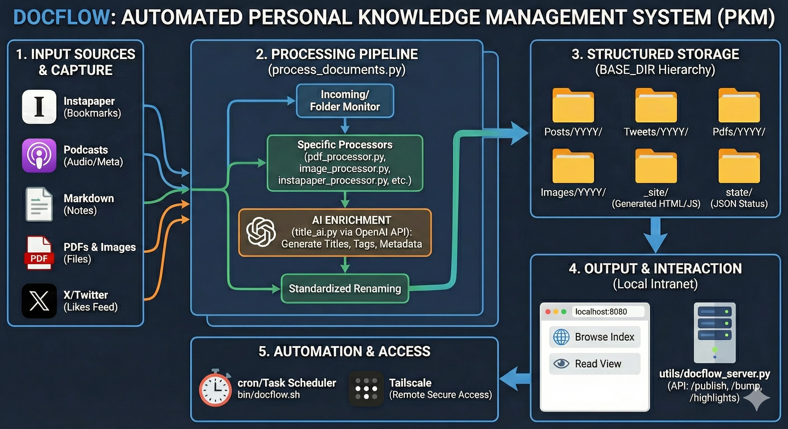

# docflow (Local Intranet)

docflow automates your personal document pipeline (Instapaper posts, podcasts, Markdown notes, PDFs, images, and tweets) and serves everything locally from `BASE_DIR`.

## Architecture overview



## What this repo does now

- Single local source of truth: `BASE_DIR` (configured in `config.py`).
- Single local server: `python utils/docflow_server.py`.
- Static site output under `BASE_DIR/_site`.
- Local state under `BASE_DIR/state`.
- No remote deploy flow in this repository.

## Main folders

`BASE_DIR` is expected to contain:

- `Incoming/`
- `Posts/Posts <YEAR>/`
- `Tweets/Tweets <YEAR>/`
- `Podcasts/Podcasts <YEAR>/`
- `Pdfs/Pdfs <YEAR>/`
- `Images/Images <YEAR>/`
- `_site/` (generated)
- `state/` (generated)

## Requirements

- Python 3.10+
- Core dependencies:

```bash
pip install requests beautifulsoup4 markdownify openai pillow pytest markdown
```

Optional for X likes queue:

```bash
pip install "playwright>=1.55"
playwright install chromium
```

## Quick start

1. Configure environment variables (as needed):

```bash
export OPENAI_API_KEY=...
export INSTAPAPER_USERNAME=...
export INSTAPAPER_PASSWORD=...
export TWEET_LIKES_STATE=/Users/<you>/.secrets/docflow/x_state.json
export TWEET_LIKES_URL=https://x.com/<user>/likes
export TWEET_LIKES_MAX=50
```

Keep `TWEET_LIKES_STATE` outside the repo so cleanup operations do not delete it.

2. Run the processing pipeline:

```bash
python process_documents.py all --year 2026
```

3. Build local intranet pages:

```bash
python utils/build_browse_index.py --base-dir "/Users/domingo/⭐️ Documentación"
python utils/build_read_index.py --base-dir "/Users/domingo/⭐️ Documentación"
```

4. Run local server:

```bash
python utils/docflow_server.py --base-dir "/Users/domingo/⭐️ Documentación" --host 127.0.0.1 --port 8080
```

Optional full rebuild at startup:

```bash
python utils/docflow_server.py --base-dir "/Users/domingo/⭐️ Documentación" --rebuild-on-start
```

### Auto-start on macOS (launchd)

To start intranet automatically at login and keep it alive, use a user `LaunchAgent`:

```bash
cat > ~/Library/LaunchAgents/com.domingo.docflow.intranet.plist <<'PLIST'
<?xml version="1.0" encoding="UTF-8"?>
<!DOCTYPE plist PUBLIC "-//Apple//DTD PLIST 1.0//EN" "http://www.apple.com/DTDs/PropertyList-1.0.dtd">
<plist version="1.0">
<dict>
  <key>Label</key><string>com.domingo.docflow.intranet</string>
  <key>ProgramArguments</key>
  <array>
    <string>/opt/homebrew/bin/python3.11</string>
    <string>/Users/domingo/Programacion/Python/docflow/utils/docflow_server.py</string>
    <string>--base-dir</string><string>/Users/domingo/⭐️ Documentación</string>
    <string>--host</string><string>127.0.0.1</string>
    <string>--port</string><string>8080</string>
    <string>--rebuild-on-start</string>
  </array>
  <key>WorkingDirectory</key><string>/Users/domingo/Programacion/Python/docflow</string>
  <key>RunAtLoad</key><true/>
  <key>KeepAlive</key><true/>
  <key>StandardOutPath</key><string>/Users/domingo/Library/Logs/docflow/intranet.out.log</string>
  <key>StandardErrorPath</key><string>/Users/domingo/Library/Logs/docflow/intranet.err.log</string>
</dict>
</plist>
PLIST

launchctl bootstrap gui/$(id -u) ~/Library/LaunchAgents/com.domingo.docflow.intranet.plist
launchctl kickstart -k gui/$(id -u)/com.domingo.docflow.intranet
```

### Tailscale access (tailnet only)

Expose intranet via Tailscale to your tailnet:

```bash
tailscale up
tailscale serve --bg 8080
tailscale serve status
```

### Auto-start Tailscale serve on macOS

Use a second `LaunchAgent` so login starts Tailscale and reapplies `serve`:

```bash
cat > ~/Library/LaunchAgents/com.domingo.tailscale.autostart.plist <<'PLIST'
<?xml version="1.0" encoding="UTF-8"?>
<!DOCTYPE plist PUBLIC "-//Apple//DTD PLIST 1.0//EN" "http://www.apple.com/DTDs/PropertyList-1.0.dtd">
<plist version="1.0">
<dict>
  <key>Label</key><string>com.domingo.tailscale.autostart</string>
  <key>ProgramArguments</key>
  <array>
    <string>/bin/zsh</string>
    <string>-lc</string>
    <string>tailscale up && tailscale serve --bg 8080</string>
  </array>
  <key>RunAtLoad</key><true/>
  <key>KeepAlive</key><false/>
  <key>StandardOutPath</key><string>/Users/domingo/Library/Logs/docflow/tailscale.autostart.out.log</string>
  <key>StandardErrorPath</key><string>/Users/domingo/Library/Logs/docflow/tailscale.autostart.err.log</string>
</dict>
</plist>
PLIST

launchctl bootstrap gui/$(id -u) ~/Library/LaunchAgents/com.domingo.tailscale.autostart.plist
launchctl kickstart -k gui/$(id -u)/com.domingo.tailscale.autostart
```

## Unified runner (`bin/docflow.sh`)

Use this wrapper for cron/manual runs:

```bash
bash bin/docflow.sh all
```

Behavior:

- Loads `~/.docflow_env` if present.
- Runs `process_documents.py` with your arguments.
- If target is `all`, runs `bin/build_tweet_consolidated.sh --yesterday`.
- Rebuilds intranet browse/read pages (`utils/build_browse_index.py` and `utils/build_read_index.py`) when processing succeeds.

Optional override:

```bash
INTRANET_BASE_DIR="/path/to/base" bash bin/docflow.sh all
```

## Intranet server API

`utils/docflow_server.py` serves:

- Static files from `BASE_DIR/_site`
- Raw files from `BASE_DIR` routes (`/posts/raw/...`, `/tweets/raw/...`, etc.)
- `browse` list default ordering: bumped entries first, then published entries, then the rest
- `browse` pages include a top `Highlights first` toggle to prioritize highlighted items
- `read` list ordering: bumped entries first, then non-bumped entries by publish time (newest first)
- JSON API actions:
  - `POST /api/publish`
  - `POST /api/unpublish`
  - `POST /api/bump`
  - `POST /api/unbump`
  - `POST /api/delete`
  - `POST /api/rebuild`
  - `POST /api/rebuild-file`
  - `GET /api/highlights?path=<rel_path>`
  - `PUT /api/highlights?path=<rel_path>`

## Tweet pipeline

- Queue from likes feed:

```bash
python process_documents.py tweets
```

- One-time browser state creation:

```bash
python utils/create_x_state.py --state-path /Users/<you>/.secrets/docflow/x_state.json
```

- Daily consolidated tweets helper:

```bash
bash bin/build_tweet_consolidated.sh
bash bin/build_tweet_consolidated.sh --day 2026-02-13
bash bin/build_tweet_consolidated.sh --all-days
bash bin/build_tweet_consolidated.sh --all-days --cleanup-existing
```

`--cleanup-existing` removes only source tweet `.html` files for consolidated days and keeps source `.md`.

## Tests

Run all tests:

```bash
pytest -v
```

Targeted example:

```bash
pytest tests/test_docflow_server.py -q
```

## Documentation

- `docs/intranet-mode.md`: canonical intranet behavior and rebuild model.
