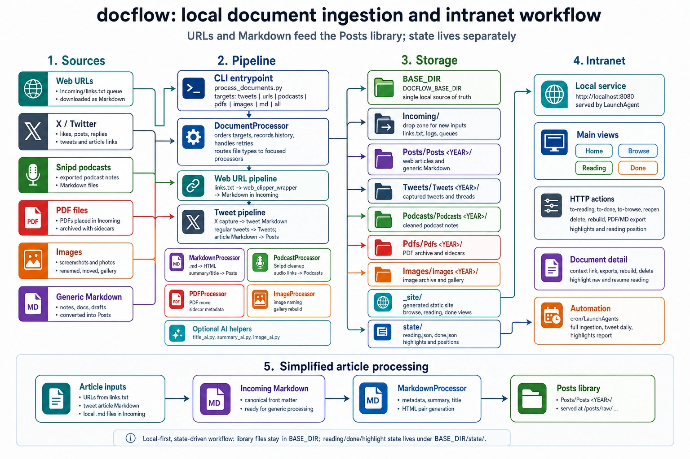

# docflow (Local Intranet)

docflow automates your personal document pipeline (Instapaper posts, podcasts, Markdown notes, PDFs, images, and tweets) and serves everything locally from `BASE_DIR`.

Podcast snippets are typically captured in [Snipd](https://www.snipd.com) and then exported into this pipeline.

## Architecture overview



## Current functionality

- Single local source of truth: `BASE_DIR` (resolved from `DOCFLOW_BASE_DIR`, typically in `~/.docflow_env`).
- Static site output under `BASE_DIR/_site`.
- Local workflow state under `BASE_DIR/state`.
- Image ingestion moves files into the yearly folder and, when `OPENAI_API_KEY` is configured, renames them with an AI-generated descriptive filename before rebuilding the gallery.

### Local services currently in use

- Intranet at `http://localhost:8080`
  - Managed day to day by LaunchAgent `com.domingo.docflow.intranet`.
  - Serves the generated site plus raw content under `/posts/raw/...`, `/tweets/raw/...`, `/pdfs/raw/...`, `/images/raw/...`, and `/podcasts/raw/...`.
- RemoteControl at `http://localhost:3000`
  - Managed by LaunchAgent `com.domingo.remotecontrol.web`.
  - Exposes an on-demand docflow task (`Docflow: descargar/documentar`) alongside non-docflow tasks.

### Intranet capabilities

`utils/docflow_server.py` currently offers:

- Home page with exact filename search.
- Browse / Reading / Working / Done views.
- Browse hides items already in Reading / Working / Done.
- Highlight toggle on list pages, with browser-persistent state until switched back off.
- With `Highlight: on`, highlighted items move first and are ordered by most recent highlight.
- In `Done`, `Highlight: on` regroups items by the year of the latest highlight, so re-highlighted older items surface under the current highlight year.
- Reading ordered by `reading_at` (oldest first).
- Working ordered by `working_at` (newest first).
- Done ordered by `done_at` (newest first).
- Stage transitions from the UI (`Move to Reading`, `Move to Working`, `Move to Done`, `Back to Browse`, `Reopen to Reading`).
- Per-article actions in the overlay:
  - Context link (`Inside Browse`, `Inside Reading`, `Inside Working`, `Inside Done`)
  - `PDF` export
  - `MD` export
  - `Rebuild`
  - `Delete`
- Highlight navigation on article pages when highlights exist (`Jump to highlight`, previous/next controls).

### Intranet API

Documented and currently available endpoints:

- `POST /api/to-reading`
- `POST /api/to-working`
- `POST /api/to-done`
- `POST /api/to-browse`
- `POST /api/reopen`
- `POST /api/delete`
- `POST /api/rebuild`
- `POST /api/rebuild-file`
- `GET /api/export-pdf?path=<rel_path>`
- `GET /api/export-markdown?path=<rel_path>`
- `GET /api/highlights?path=<rel_path>`
- `PUT /api/highlights?path=<rel_path>`

If `DONE_LINKS_FILE` is set, each `POST /api/to-done` transition appends a Markdown link entry to that file.

### Local state files

All state is stored under `BASE_DIR/state/`:

- `reading.json`: per-path `reading_at` timestamp.
- `working.json`: per-path `working_at` timestamp.
- `done.json`: per-path `done_at` timestamp and optional transition metadata copied on `to-done`:
  - `reading_started_at` (from `reading_at` when moving from Reading to Done)
  - `working_started_at` (from `working_at` when moving from Working to Done)
- `highlights/<sha256-prefix>/<sha256>.json`: canonical per-document highlight payloads, including per-highlight `created_at` timestamps and document `updated_at`.

These fields allow post-hoc lead-time calculations for completed items (for example `done_at - working_started_at`).

### Background automations currently in use

The current local setup uses both LaunchAgents and `cron`.

LaunchAgents:

- `~/Library/LaunchAgents/com.domingo.docflow.intranet.plist`
  - Starts the docflow intranet on port `8080`.
- `~/Library/LaunchAgents/com.domingo.remotecontrol.web.plist`
  - Starts the RemoteControl web UI on port `3000`.

Current `crontab` jobs related to docflow:

- Every 6 hours: `/Users/domingo/Programacion/computer-ops/ops/bin/docflow_all.sh`
  - Runs the full ingestion pipeline and rebuilds the intranet outputs.
- Daily at `02:00`: `/Users/domingo/Programacion/computer-ops/ops/bin/docflow_tweet_daily.sh`
  - Builds the previous day's consolidated tweets and rebuilds the intranet outputs.
- Daily at `02:05`: `/Users/domingo/Programacion/computer-ops/ops/bin/docflow_highlights_daily.sh`
  - Builds the previous day's highlights report Markdown.

The shared cron log is:

```bash
~/Library/Logs/remotecontrol/docflow.cron.log
```

### Main folders

`BASE_DIR` is expected to contain:

- `Incoming/`
- `Posts/Posts <YEAR>/`
- `Tweets/Tweets <YEAR>/`
- `Podcasts/Podcasts <YEAR>/`
- `Pdfs/Pdfs <YEAR>/`
- `Images/Images <YEAR>/`
- `_site/` (generated)
- `state/` (generated)

## Operation and maintenance

### BASE_DIR location

- `BASE_DIR` comes from environment variable `DOCFLOW_BASE_DIR`.
- Canonical place to set it: `~/.docflow_env`.
- If `DOCFLOW_BASE_DIR` is missing, importing `config.py` fails with a clear error.
- For direct commands from this repo, load your environment first:

```bash
source ~/.docflow_env
```

Recommended `~/.docflow_env` snippet:

```bash
export DOCFLOW_BASE_DIR="/path/to/BASE_DIR"
export INTRANET_BASE_DIR="$DOCFLOW_BASE_DIR"
export HIGHLIGHTS_DAILY_DIR="/path/to/Obsidian/Subrayados"
export DONE_LINKS_FILE="/path/to/Obsidian/Leidos.md"
```

### Requirements

- Python 3.10+
- Core dependencies:

```bash
pip install requests beautifulsoup4 markdownify openai pillow pytest markdown
```

Optional for X likes queue:

```bash
pip install "playwright>=1.55"
playwright install chromium
```

### Manual quick start

1. Configure environment variables (as needed):

```bash
export OPENAI_API_KEY=...
export INSTAPAPER_USERNAME=...
export INSTAPAPER_PASSWORD=...
export DOCFLOW_BASE_DIR="/path/to/BASE_DIR"
export TWEET_LIKES_STATE="$HOME/.secrets/docflow/x_state.json"
export TWEET_LIKES_URL=https://x.com/<user>/likes
export TWEET_LIKES_MAX=50
export HIGHLIGHTS_DAILY_DIR="/path/to/Obsidian/Subrayados"
export DONE_LINKS_FILE="/path/to/Obsidian/Leidos.md"
```

Keep `TWEET_LIKES_STATE` outside the repo so cleanup operations do not delete it.

2. Run the processing pipeline:

```bash
python process_documents.py all --year 2026
```

3. Build local intranet pages manually:

```bash
python utils/build_browse_index.py --base-dir "$DOCFLOW_BASE_DIR"
python utils/build_reading_index.py --base-dir "$DOCFLOW_BASE_DIR"
python utils/build_working_index.py --base-dir "$DOCFLOW_BASE_DIR"
python utils/build_done_index.py --base-dir "$DOCFLOW_BASE_DIR"
```

4. Run the intranet server manually (mainly for troubleshooting):

```bash
source ~/.docflow_env
python utils/docflow_server.py --base-dir "$DOCFLOW_BASE_DIR" --host localhost --port 8080
```

Optional full rebuild at startup:

```bash
source ~/.docflow_env
python utils/docflow_server.py --base-dir "$DOCFLOW_BASE_DIR" --rebuild-on-start
```

### LaunchAgent management

Preferred day-to-day usage is the LaunchAgent-managed intranet service:

```bash
launchctl kickstart -k "gui/$(id -u)/com.domingo.docflow.intranet"
```

Useful status checks:

```bash
launchctl print "gui/$(id -u)/com.domingo.docflow.intranet" | rg 'state =|pid =|last exit code ='
launchctl print "gui/$(id -u)/com.domingo.remotecontrol.web" | rg 'state =|pid =|last exit code ='
curl -s -o /dev/null -w '%{http_code}\n' http://127.0.0.1:8080/
curl -s -o /dev/null -w '%{http_code}\n' http://127.0.0.1:3000/
```

If a LaunchAgent is not loaded yet in a new environment:

```bash
launchctl bootstrap "gui/$(id -u)" ~/Library/LaunchAgents/com.domingo.docflow.intranet.plist
launchctl bootstrap "gui/$(id -u)" ~/Library/LaunchAgents/com.domingo.remotecontrol.web.plist
```

### Cron inspection

Inspect the current scheduled jobs with:

```bash
crontab -l
```

### Manual runners

Full document ingestion runner:

```bash
bash bin/docflow.sh all
```

Behavior:

- Loads `~/.docflow_env` if present.
- Runs `process_documents.py` with your arguments (`all` for full ingestion).
- Rebuilds intranet browse/reading/working/done pages when processing succeeds.

Optional override:

```bash
INTRANET_BASE_DIR="/path/to/base" bash bin/docflow.sh all
```

Dedicated daily tweet consolidation runner:

```bash
bash bin/docflow_tweet_daily.sh
```

Behavior:

- Loads `~/.docflow_env` if present.
- Runs `bin/build_tweet_consolidated.sh --yesterday`.
- Rebuilds intranet browse/reading/working/done pages when consolidation succeeds.

Tweet queue from likes feed:

```bash
python process_documents.py tweets
```

One-time browser state creation:

```bash
python utils/create_x_state.py --state-path "$HOME/.secrets/docflow/x_state.json"
```

Daily consolidated tweets helper:

```bash
bash bin/build_tweet_consolidated.sh
bash bin/build_tweet_consolidated.sh --day 2026-02-13
bash bin/build_tweet_consolidated.sh --all-days
bash bin/build_tweet_consolidated.sh --all-days --cleanup-existing
```

By default, daily grouping for tweet source files uses a local rollover hour at `03:00`
to include just-after-midnight downloads in the previous day. Override with
`DOCFLOW_TWEET_DAY_ROLLOVER_HOUR` (`0`-`23`) when needed.

`--cleanup-existing` removes only source tweet `.html` files for consolidated days and keeps source `.md`.

Daily highlights report helper:

```bash
python utils/build_daily_highlights_report.py --day 2026-02-13 --output "/tmp/highlights-2026-02-13.md"
```

Daily highlights report runner:

```bash
bash bin/docflow_highlights_daily.sh
```

Clipboard Markdown helper:

```bash
bin/mdclip
```

Behavior:

- Reads HTML from clipboard when available (`pbpaste -Prefer html`, then macOS pasteboard fallbacks).
- Converts to Markdown and removes extra blank lines between list items.
- Writes cleaned Markdown back to clipboard by default.

Useful flags:

```bash
bin/mdclip --print
bin/mdclip --no-copy
bin/mdclip --from-stdin --no-copy --print < /path/to/input.html
```

Keyboard shortcut bindings (for example `cmd+shift+L`) are configured outside this repo (Shortcuts/automation tool). The versioned command to invoke is `bin/mdclip`.

## Tests

Run all tests:

```bash
pytest -v
```

Targeted example:

```bash
pytest tests/test_docflow_server.py -q
```

## Optional remote access

You can expose the local intranet through a private VPN (for example, Tailscale).
